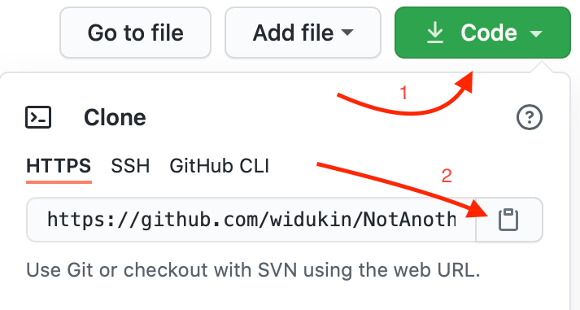
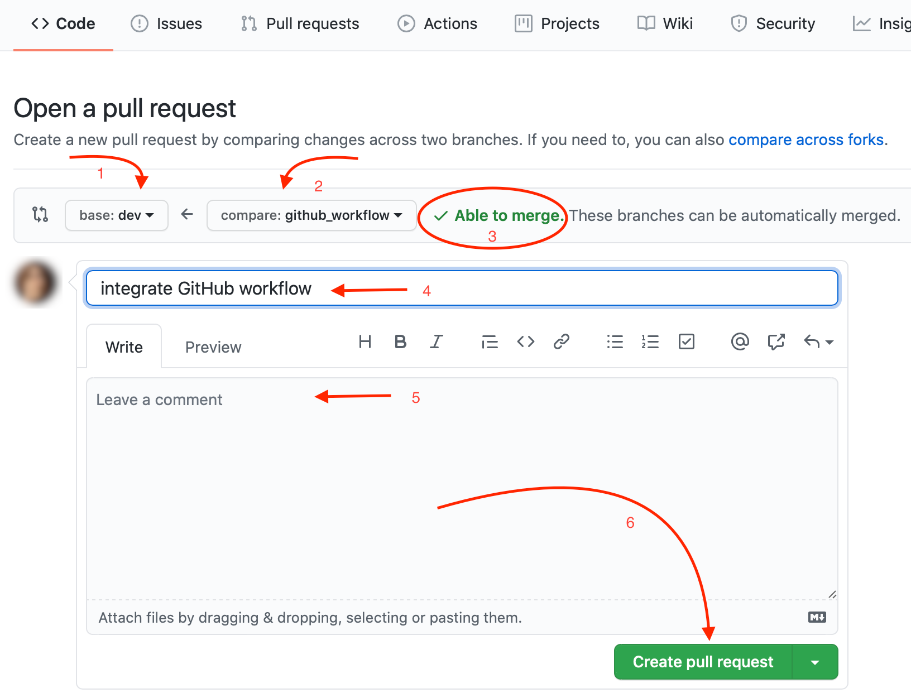
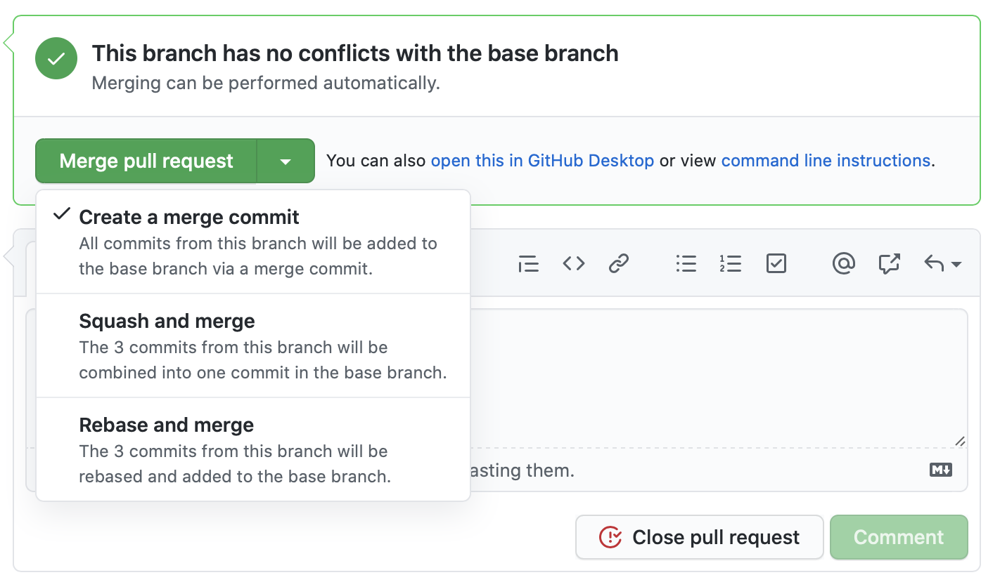

# GIT | GITHUB WORKFLOW

## Table of Contents

- [Set-up](#set-up)
- [Workflow](#workflow)
- [Commands](#commands)
- [Bibliography](#bibliography)

## Set-up

### Admin

Follow these steps in order to set-up a React application and connect it to Github:

1. Create a React application:

```bash
npx create-react-app your_react_app_name

```

2. Create a repository on [Github](https://github.com/). Since the React app already contains a git repo, no need to initialize a git repo locally or clone from GitHub.

3. Link your local repo with Gihub:

```bash
git remote add origin address_to_your_github_repo.git
```

3. Rename master branch to main:

```bash
$ git checkout master
$ git -M main
```

4. Create a development branch locally:

```bash
$ git checkout -b dev
```

5. Delete any files you don't need from the initial React app.

6. Commit and push your changes:

```bash
$ git add .
$ git commit -m "Initial commit"
$ git push origin dev
```

7. Add team members as contributors on Github:
   

8. Change default branch to dev

### Contributors

If you are a project contributor, follow these steps for setting up your local git repository:

1. Copy repository URL on Github:

   

2. Clone repository to your local machine:

```
$ git clone [url provided on Github]
```

3. Make sure to be in the main/master branch

Either your git bash shows the branch you are working with or you can call

```
$ git branch
```

and look for the branch with the star (\*):

## Workflow

Follow these steps if you new to create a new feature, make some changes or fix a bug.

1. Update your local development branch:

```
$ git checkout dev
$ git pull origin dev
```

2. Creating a working branch locally:

```
$ git checkout -b [working_branch_name]
```

3. Make sure you are working on your working branch:

```
$ git branch
```

You should see all existing branches and your working branch with a star \*

4. Make the changes needed
5. Once you are done, add your changes to the stagins area:

```
$ git add.
```

5. Check that everything is OK:

```
$ git status
```

5. Commit your changes:

```
$ git commit -m "a good commit meassage"
```

6. Create as many commits as needed until you have solved the initial issue that motivated the creation of the working branch.

7. Once you are done, push your commits to Github:

```
$ git push origin [work_branch_name]
```

6. On Github, create a pull request (base: dev, compare: [work_branch_name])

7. Resolve possible merge conflicts:

8. Give a meaningful title and description and avoid including redundant information. Add pictures if needed.

9. Add reviewers to your PR.
   
   

### Handling pull requests

Merging should be a team approach.

1. Review

The assigned Reviewers do their review comments and approve or request changes on the PR.


2. Implement the required changes

Follow the [daily workflow steps](#daily_workflow).

3. Merge the Pull Request:
   

4. Delete your remote working branch
   

5. Delete your local working branch:

```
$ git checkout [development_branch_name]
$ git branch -d [working_branch_name]
```

6. Update the state of your local repo:

```
$ git fetch -p
```

### Merging dev branch with main/master branch

1. Create a pull request from the dev branch to the main/master branch on github
2. Add Reviewers
3. Reviewing Process
4. Merge PR

**Do not delete the development branch!**

## Commands

- Check existing remote branches:

```
$ git branch -r
```

- Check existing local and remote branches:

```
$ git branch -a
```

## Bibliography

- [Create a new branch with git and manage branches](https://github.com/Kunena/Kunena-Forum/wiki/Create-a-new-branch-with-git-and-manage-branches)
